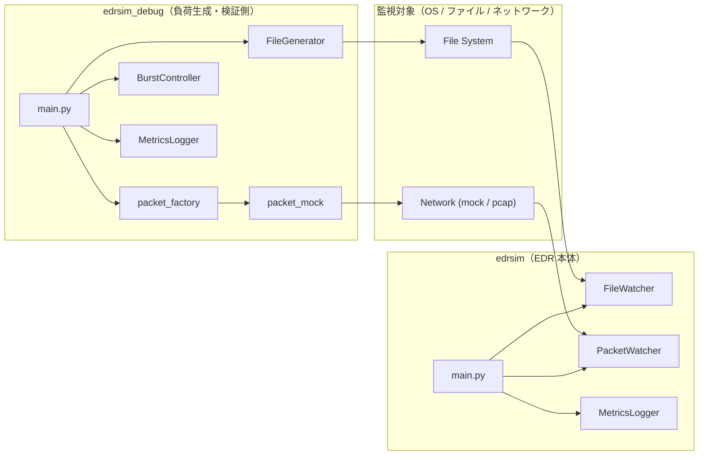
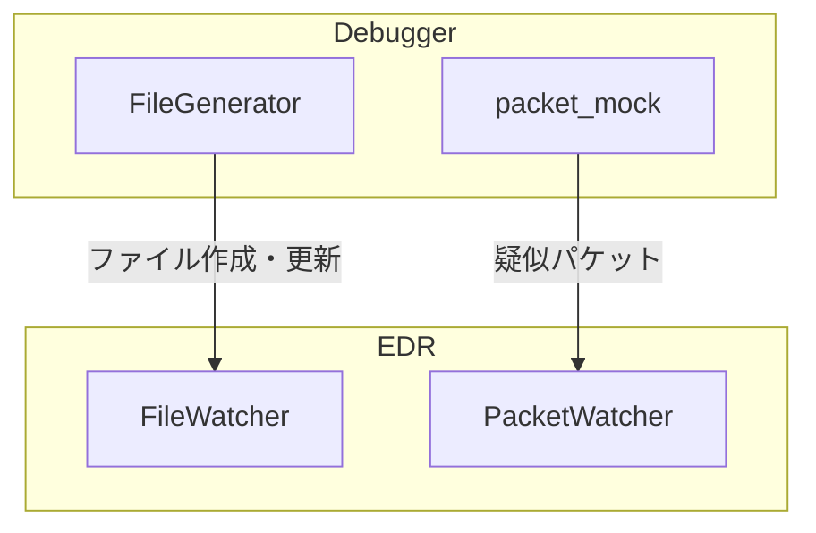

# edrsim アーキテクチャ概要

本ドキュメントでは edrsim の全体構成、責務分離、ログ・メトリクス設計思想を説明する。


## 1. 全体構成

edrsim は以下 3 レイヤで構成される。

````

┌──────────────────────────┐
│        config.yaml       │
└────────────┬─────────────┘
             │
┌────────────▼─────────────┐
│          core            │
│  logger / metrics / bc   │
└──────┬─────────┬─────────┘
       │         │
┌──────▼───┐ ┌───▼────────┐
│ file     │ │ packet     │
│ watcher  │ │ watcher    │
└──────────┘ └────────────┘

```

### 各機能の関わり概要図




## 2. core レイヤ

### core/logger.py

- JSON ログ出力
- component 単位ロガー
- config_hash 自動付与
- ログローテーション

**設計思想**

> 「後から、この負荷はどの設定だったのか」を必ず再現できること


### core/metrics.py

- プロセス単位 CPU / メモリ監視
- 定期ログ出力
- multiprocessing 環境対応


### core/burst_controller.py

- 短時間イベント集中を検知
- 意図的なスリープ挿入
- 実 EDR のスロットリング挙動を再現


## 3. edrsim（EDR 本体）

### file_watcher

- ファイル作成・更新イベント検知
- hash loop による CPU 負荷再現
- バースト制御適用

### packet_watcher

- mock モードによる疑似通信処理
- payload 処理負荷を hash loop で再現
- multiprocessing 分離実行


## 4. edrsim_debug（負荷生成）

- ファイル生成
- 疑似パケット送信
- EDR 側の反応を観測するためのツール


## 5. ログ構成（文章図）

- 各 component は **独立したログファイル**
- すべてのログに以下を付与

  - timestamp
  - component
  - config_hash

```

logs/
├─ edr_mock.log
├─ edr-mock_file_watcher.log
├─ edr-mock_packet_watcher.log
├─ metrics.log
└─ metrics_debug.log

```


## 6. なぜこの構成なのか

- 実 EDR はブラックボックス
- 「重い理由」を説明できない
- 本ツールは **説明可能な負荷再現**を目的とする


## 7. 設計上の割り切り

- 検知ロジックは実装しない
- マルウェア解析はしない
- あくまで **性能・挙動の理解用**


### EDRsimとデバッカーの対応概要




## 8. 将来拡張ポイント

- pcap 入力
- OpenTelemetry 連携
- 負荷シナリオ定義
- EDR モード切替
